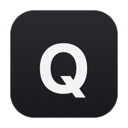

<p align="center">
  
  <h1 align="center">SuperQ</h1>
  <p align="center">
    <strong>SuperF4 for macOS. Instant force-quit with <code>⇧⌘Q</code> (or your custom shortcut).</strong>
  </p>
  <p align="center">
    <a href="LICENSE"></a>
    
    
    
  </p>
</p>

---

On macOS, pressing `⌘Q` asks an application to quit nicely. If an app has crashed, beachballed, or opened an unclosable dialog, it simply ignores you.

**SuperQ** sends an instant, uncatchable `SIGKILL` the moment you trigger the shortcut.

No beachball. No waiting for timeouts. No confirmation prompts.

---

## ⚡ Features

- **Instant Force-Quit**: Terminates the active foreground application immediately via kernel `SIGKILL`.
- **Customizable Shortcuts**:
  - Default: **`⇧⌘Q`** (Shift + Command + Q)
  - Quick Presets: `⌥⌘Q`, `⌃⌘Q`, `⌃⌥⌘Q`, `⌃⇧⌘Q`, `⌥⇧⌘Q`
  - **Custom Key Combination**: Record any combination you like (e.g. `⌃⌥F4`, `⌥⌘K`) directly in the app.
- **Minimal Menu Bar**: Clean, lightweight `Q` in your menu bar. No dock icon, no clutter.
- **Configurable Feedback**:
  - Audio confirmation (toggle on/off)
  - Floating translucent HUD bezel (toggle on/off)
- **Zero Daemon Bloat**: Uses **0.0% CPU** and ~0.1% RAM when idling.
- **Launch at Login**: One-click autostart toggle using native macOS `SMAppService`.
- **Private & Offline**: No network access, no telemetry, no tracking. Ever.

---

## ⌨️ Changing the Shortcut

You can change your force-quit shortcut anytime from the menu bar:

1. Click the **`Q`** icon in your macOS menu bar.
2. Open the **Shortcut** submenu.
3. Choose one of the built-in presets (e.g. `⌥⌘Q`, `⌃⌘Q`), or select **Custom Shortcut...** to press and record any key combination of your choice.

---

## 📥 Installation

### Download Disk Image (.dmg)

1. Download the latest **`SuperQ.dmg`** from [**Releases**](../../releases).
2. Open the disk image and drag **SuperQ** into your **Applications** folder.
3. Launch **SuperQ** from Applications or Spotlight.

> **Note**: Because SuperQ is an independent open-source tool distributed outside the Mac App Store, macOS may show a prompt on first launch. Right-click `SuperQ.app` and select **Open**, or go to **System Settings > Privacy & Security** and click **Open Anyway**.

---

## 💡 Note on macOS `⇧⌘Q` (Log Out Shortcut)

In standard macOS, `⇧⌘Q` is mapped to **"Log Out [User]…"** in the Apple menu.

SuperQ registers `⇧⌘Q` globally to intercept the shortcut. However, if macOS displays the *"Are you sure you want to log out?"* confirmation dialog when you press `⇧⌘Q`:

- **Option A (Instant)**: In the SuperQ menu > **Shortcut**, click **`⌥⌘Q`** or set a custom shortcut. These have zero conflict with macOS system hotkeys.
- **Option B (Keep `⇧⌘Q`)**: Rebind Apple's Logout shortcut:
  1. Go to **System Settings** > **Keyboard** > **Keyboard Shortcuts…** > **App Shortcuts**.
  2. Click **`+`**, select **All Applications**, set Menu Title to `Log Out <Your Username>…` *(e.g. `Log Out Jane Doe…` — type the ellipsis with `Option + ;`)*.
  3. Assign an obscure shortcut like `⌃⌥⇧⌘Q` and click **Done**.

---

## 🛠 Building from Source

No third-party package managers or external dependencies required.

```bash
# Clone the repository
git clone https://github.com/your-username/superq.git
cd superq

# Build the .app bundle
./scripts/build_app.sh

# Or build the distributable .dmg installer
./scripts/build_dmg.sh
```

---

## ⚖️ Legal & Disclaimers

### Data Loss Warning
SuperQ uses the POSIX `SIGKILL` signal to terminate applications instantly. When an application is terminated via `SIGKILL`, it does not have the opportunity to save unsaved documents, state, or flush pending buffers. Use your force-quit shortcut when you intend to terminate an app immediately.

### Trademarks
- macOS, Mac, and Apple are registered trademarks of Apple Inc.
- Windows is a registered trademark of Microsoft Corporation.
- SuperF4 is developed by Stefan Sundin. SuperQ is an independent macOS project inspired by SuperF4.

---

## 📄 License

SuperQ is open source software licensed under the [MIT License](LICENSE).
